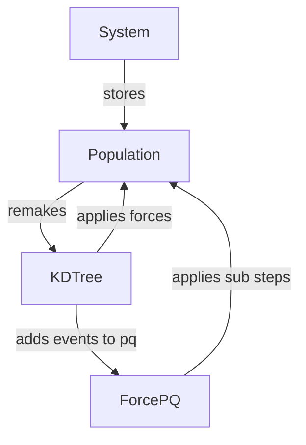
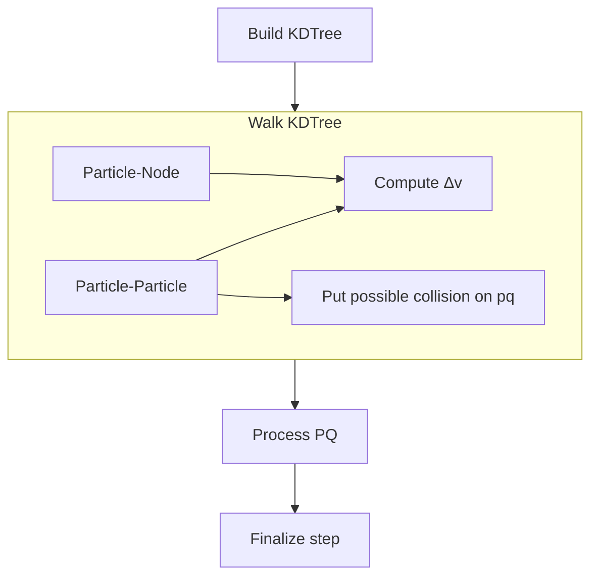

# Collisional Simulations in Rust

This repository holds a version of my simulation code written in Rust since I'm tired of trying to maintain old C++ code.

## Outline

- System (global config)
- Population (particle data)
- ForcePQ (sub-steps)
- KDTree (gravity forces)



## One Step




## Notes

- Particle-Node gravity is applied for full step.
- Particle-Particle gravity is applied till next pq event.
- KDTree: $\Delta v$ will be collected and applied at the end of going through all particles.

## Notes - Dec 2
- How long should the collision
- turn off gravity feature
- check if collision velocity goes down during collision - should be highest
- make the big timestep like 1

## Notes - Dec 9
- bug: elastic collision if 10x radius diff

## Notes - Jan 27
- still does many small time steps even if big time step count > desired steps
- test: vary big time step
- test: big time step in middle of collision
- test: 1 big step before collision and one near the end
- so if time steps are really big its well behaved
- too many small steps taken
- adjust small time step counter: only count collision small steps

## Notes - Feb 3
- test analysis: 
    ```radius_0,radius_1,desired_impact_vel,time_step,rho,coeff_of_res,max_pen_depth_percent_0,max_pen_depth_percent_1,collision_steps,real_impact_vel,desired_collision_step_count
    ```

- current method of finding the exit velocity doesn't work if there is only 1 collision step

## Notes - Feb 10
- various epsilons: 0.1 to 1
- find thesis comittee members - mehta and who?

- also: the early_quit method currently requires no_gravity
- TODO: f64's might be negative when I expect them to be positive

## Notes - Feb 17
- at the very beginning of step, do v += hillsForce * dt
  - https://github.com/MarkCLewis/NonSphericalSoftSphere/blob/723cd6fedb15ee1538ae157055640179938c5026/src/simulations/NBodyMutableSim.scala#L119
- slidingBrickBoundary ? also up there
  - do at end of time step, 100k to 1M particles
  - random location with velocity (vx=0, vy=-1.5x, vz=0)
  - size of cell, 1e-5 to 1e-6, square cell?
  - z - random, on order of particle size (+- 1e-7)
  - output: x,y,z,r text for now (every big time step: 2pi/1000) up to (5k-10k)
- fix termination of run

## Notes - Feb 24
- Format `x y z r`


## Notes - March 3
- TODO: 2-particle with gravity! - done
  - fix termination of run - done
- comment out boundary condition in x
- what particles are causing the issue, did they just jump?
- test 3 particle combos, like - done
-    a --> b  c
-    a --> b <-- c
- print warn if overlap is significantly too big

## Notes - March 10
- minimum dt based on distance / velocity
- particles overlapping should be processed more often too on pq (some fraction of big dt)
  - some max dt for overlapping particles
  - like 1/100th
  - what is the distance?
    - 2% of min(r1, r2) / 20?
  - for speed, see `determine what speed to expect`
- re-find neighbors idea?
  - particle radius / big dt is a measure of what is a big change
- determine what speed to expect:
  - relative velocity of everything in every leaf
    - rel velocity of each -> add squares -> div by N -> sqrt
  - or do max for safety
  - or for most safety, do max of leaves (double for extra safety)

<!-- 
Thesis writing notes:
fundamental change in how the integrator works
write outline, put notes of everything I can think of and that is related
write about pair-collision (it works well)
issues of stability with 3+ particle
-->

## Notes - March 24
- for various sim sizes
- no pq for 10_000 - do not consider pq
- pq for 1000
- fixed amount of time
- email all about timing
- one orbit
- Do 1M, 1k, 10k, 100k
- for chapter: dumb all info in my head
- writing notes:
  - deadline: 13th
  - other methods: find neighbors on big velocity change, memory overhead problem

## Notes - March 31
- pq for 100
- no pq for 1000
- no serialize - performance only
- boundary condition problems
- could store overlap of particles info in impact_vel_tracker
  - check if particles go from barely overlapping to rly overlapping in one step
- low vs. high density
  - table: performance

