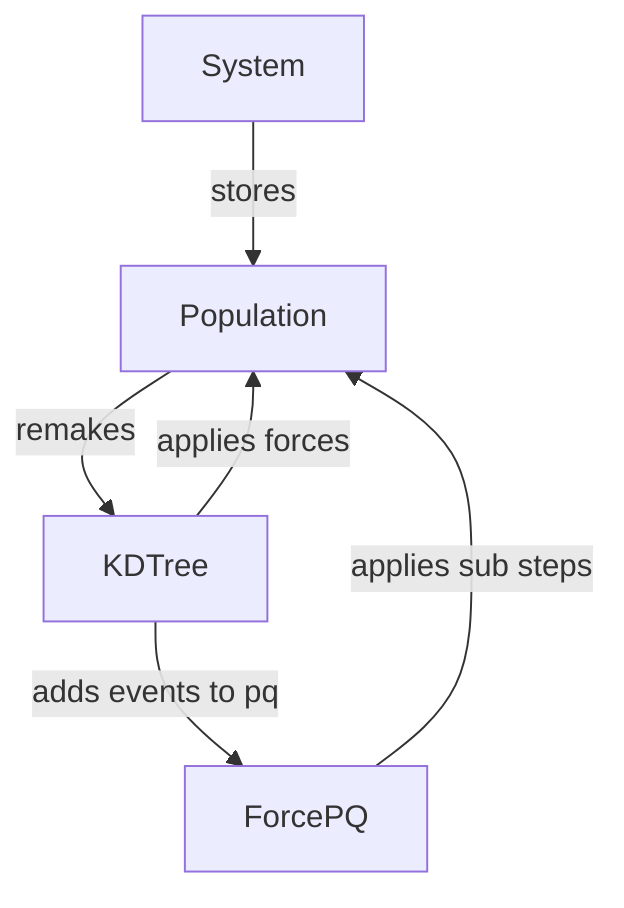

# Collisional Simulations in Rust

This repository holds a version of my simulation code written in Rust since I'm tired of trying to maintain old C++ code.

## Outline

- System (global config)
- Population (particle data)
- ForcePQ (sub-steps)
- KDTree (gravity forces)

## Notes

- Particle-Node gravity is applied for full step.
- Particle-Particle gravity is applied till next pq event.
- KDTree: $\Delta v$ will be collected and applied at the end of going through all particles.